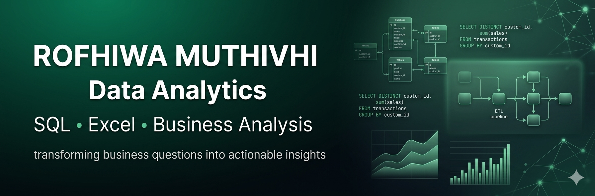

    

# Data Analytics | SQL | Excel | Business Analysis

I solve business problems through data by starting with the business challenge, asking the right questions, and using SQL and analytics to uncover insights that support informed decision-making.

I'm building a portfolio of end-to-end analytics projects while expanding my skills in data engineering. My current learning focuses on data modelling, ETL, and Power BI as I develop the skills to build scalable, business-focused data solutions.

## 🚀 Current Focus
- Building end-to-end analytics projects with SQL and Excel
- Learning Power BI
- Strengthening data engineering fundamentals
- Exploring ETL pipelines
- Building scalable, business-focused data solutions

## 📊 Featured Projects

### ☕ Coffee Sales Analysis
Analyzed coffee shop sales using SQL and Excel to identify revenue trends, customer purchasing behaviour, and actionable opportunities to improve business performance.

### 🛒 Drivers of Sales Performance
Conducted exploratory data analysis and business analysis using SQL to evaluate how store characteristics, promotions, seasonality, and economic indicators influence retail sales performance.

### 🗄️ SQL Practice Exercises
Built a strong foundation in SQL through hands-on exercises covering data retrieval, joins, aggregations, filtering, subqueries, set operations, and query optimization while solving real-world business scenarios.

## 🧰 Tools & Technologies

**Analytics**
- SQL
- Excel

**Currently Learning**
- Power BI
- Data Modelling
- ETL
- Azure

## 🧠 Core Skills
- Business Analysis
- Problem Solving
- Data Storytelling

## 📈 Data Skills Data Skills
- Data Cleaning
- Exploratory Data Analysis (EDA)
- Data Quality Assessment
- Data Visualization (Excel)

## 📍 Location
📌 Johannesburg, South Africa

## 🤝 Connect With Me
- LinkedIn

